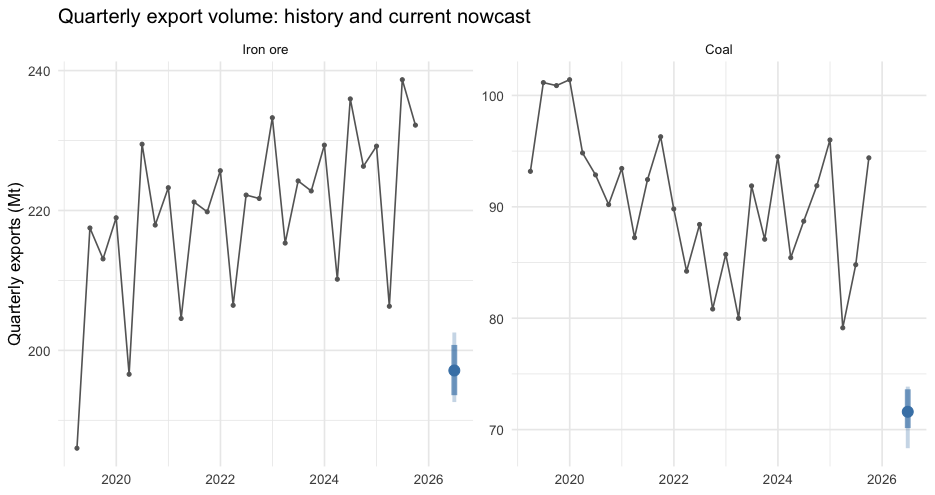
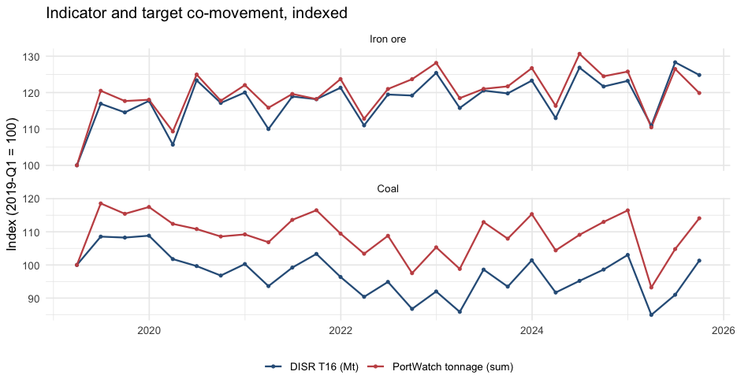
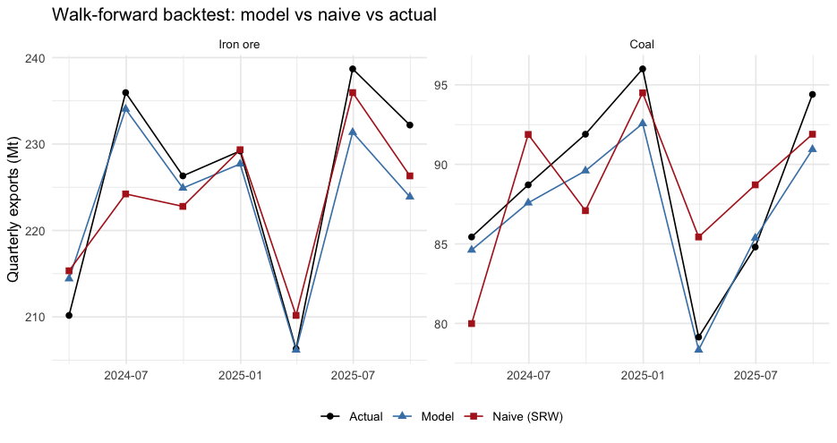
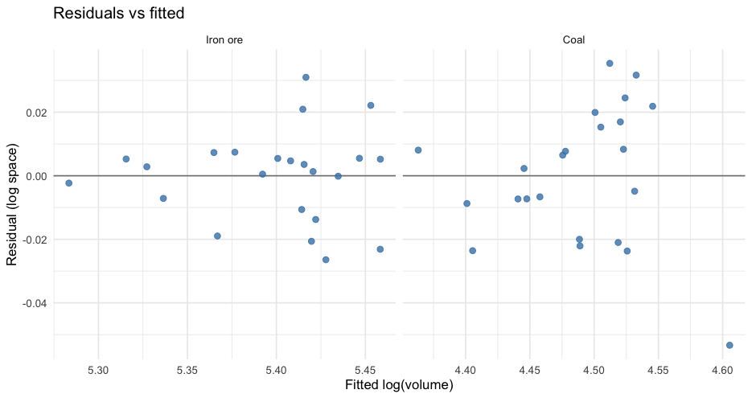

# Executive summary {-}

ResourceTracker is a running nowcast of Australian quarterly physical-tonnage
exports of two bulk mineral commodities — **iron ore** and **black coal**
(thermal and metallurgical combined) — built from a single high-frequency
indicator (IMF PortWatch daily AIS tonnage) calibrated against an official
quarterly target (DISR *Resources and Energy Quarterly*, Table 16).

- **Iron ore** nowcast for June 2026: **197.1 Mt** (80% CI 193.6 – 200.8 Mt). Share of quarter observed: 23%.
- **Coal** nowcast for June 2026: **71.6 Mt** (80% CI 70.1 – 73.6 Mt). Share of quarter observed: 23%.

The bridge regressions are fit per commodity in a per-commodity specification
regime:

- **Iron ore** uses a MIDAS (mixed-data-sampling) specification with three
  within-quarter monthly predictors.
- **Coal** uses a parsimonious aggregate specification with a single
  quarterly predictor.

Both models anchor on a year-ago LHS lag (AR(4)) and carry Newey-West HAC
standard errors. Walk-forward backtest RMSEs sit at **0.80** for iron ore
and **0.50** for coal, both below the seasonal random walk benchmark (values
< 1.0 denote the model outperforming naive).

The framework is deliberately minimal: one indicator, one target, two
models. Its design choices are documented below, including the dead ends and
why some initially promising directions (LNG coverage, monthly bridges,
chain-volume dollar targets) were abandoned in favour of the current spec.

---

# Motivation

Australian resource commodity exports — iron ore, coal, LNG, bauxite, alumina,
and so on — account for roughly half of the country's goods export earnings
and are a major driver of the current account. Timely signals on export
volume are valuable for:

- **Real-time GDP nowcasting**. Net exports of goods feed the national
  accounts; early read on physical volumes helps refine quarterly GDP
  estimates before the official release.
- **Terms-of-trade monitoring**. Combined with an independent price
  signal, volume tells us how much of a commodity-price swing translates
  into earnings.
- **Trade policy and supply-chain analysis**. Understanding whether
  shipping patterns reflect demand shifts (consignees rerouting) or
  supply shocks (mine maintenance, weather) requires separating volume
  from value.

The official source for Australian commodity export volumes — DISR
*Resources and Energy Quarterly* — publishes with a one-quarter lag; at
time of writing (Q2 2026 in progress), the most recent confirmed
observation is Q3 2025. PortWatch, by contrast, reports port-level
daily AIS tonnage with effectively no lag. A bridge regression that
translates PortWatch movements into DISR-published-volume equivalents
therefore fills a ~4–6 month information gap.

The project's scope is intentionally narrow. Early iterations (see §10)
attempted to cover LNG as well, and to target dollar-denominated
chain-volume series rather than physical tonnes. Both directions were ruled
out after the diagnostics demonstrated that the PortWatch signal was either
absent (LNG) or measurably attenuated (chain-volume $). The production
system now covers only the two commodities for which the indicator-target
relationship is econometrically viable.

---

# Data sources

## IMF PortWatch daily port activity

**Dataset**: `Daily_Ports_Data` FeatureServer layer,
`services9.arcgis.com/weJ1QsnbMYJlCHdG/ArcGIS/rest/services/Daily_Ports_Data/FeatureServer/0`.

The IMF PortWatch project publishes a daily panel of port-level activity
derived from AIS (Automatic Identification System) vessel transponder
signals. Each row is one (port, day, vessel-type) cell with export tonnage
estimates derived from vessel deadweight × observed draft-change.

Coverage is worldwide; our pull is filtered to `ISO3 = 'AUS'` and covers 57
distinct Australian ports and offshore oil terminals from 2019-01-01 to the
current day. Older observations are not available on this layer.


Table: PortWatch coverage after commodity routing (iron ore and coal only).

|Commodity | Port-days|First obs  |Last obs   | Ports|
|:---------|---------:|:----------|:----------|-----:|
|iron_ore  |      7757|2019-01-01 |2026-04-10 |     3|
|coal      |      9545|2019-01-01 |2026-04-10 |     4|

**Field schema used.** The raw FeatureServer response has one row per
(port, date) with 10 vessel-category columns. We pull seven:
`date`, `portid`, `portname`, `ISO3`, `export_dry_bulk`, `export_tanker`,
`export_container`, `export_general_cargo`, `export_roro`, `portcalls`. The
import-side columns are unused.

**Pagination.** The ArcGIS server advertises `maxRecordCount = 1000` but in
practice silently truncates queries at `resultOffset > 5000`. The ingestion
module works around this by iterating over the distinct `portid` list
returned by a `returnDistinctValues = true` query, paginating each port's
~2,657-row history in two or three pages. This produces deterministic,
complete coverage at the cost of one additional round trip.

**Rate limiting.** The server intermittently returns empty responses when
queried in tight bursts. The ingestion loop sleeps 200 ms between port
queries; a guard treats a 0-row final result as a fetch failure (rather
than overwriting the cache with an empty tibble).

## DISR Resources and Energy Quarterly, Table 16

**Dataset**: `resources-and-energy-quarterly-<month>-<year>-historical-data.xlsx`,
Sheet `"16"` ("Quarterly commodity exports, by volume").

DISR publishes the REQ each March, June, September, and December. Each
release ships a *historical-data* Excel workbook with 47 sheets; Sheet 16 is
the canonical quarterly physical-volume panel for Australian mineral and
energy exports, broken out by commodity.

Our ingestion maps two commodity groupings:


Table: DISR REQ Table 16 rows used as LHS targets. Kt values are converted to Mt for consistency.

|Commodity |DISR T16 rows         |Unit |Scope                                          |
|:---------|:---------------------|:----|:----------------------------------------------|
|iron_ore  |Row 19                |kt   |Iron ore exports (fines + lump + pellets; FOB) |
|coal      |Rows 47 + 48 (summed) |Mt   |Metallurgical + thermal coal combined          |

**URL discovery.** Release URLs follow the pattern
`https://www.industry.gov.au/sites/default/files/YYYY-MM/resources-and-energy-quarterly-MONTH-YYYY-historical-data.xlsx`.
The ingestion module probes candidate URLs in reverse-chronological order
(current quarter first, walking back six quarters) and uses the first
that responds `2xx`. A `url_override` config key is available for
reproducibility pinning.

**Workbook parsing.** Sheet 16's first 7 rows are headers/branding; the
8th row onward is data, with column 6 carrying commodity labels, column 7
the unit, and columns 8+ holding quarterly values dated via Excel serial
numbers in row 7. Data goes back to 1990-Q1.

**Download protocol.** `industry.gov.au` serves the xlsx via Akamai with
HTTP/2, but misbehaves on `httr2`'s default handshake. The `curl::curl_download`
path negotiates cleanly and completes in under a second; we use it directly.

## Port metadata

`inst/extdata/ports_metadata.csv` is a hand-curated mapping of the 15
Australian ports that account for the overwhelming majority of bulk-commodity
exports, with columns `port_name`, `iso3`, `lat`, `lon`, `commodity_class`,
and `sitc_map`. It is not the authoritative port list — that comes from
PortWatch — but it is the authoritative *commodity routing* for ports whose
activity we want to attribute to a named commodity.

---

# Data transformations

## Commodity routing

PortWatch's schema is vessel-type based, not commodity-based. A single port
(e.g. Dampier) may simultaneously export iron ore via dry-bulk carriers and
LNG via tankers. Converting the wide schema into a `(port, date, commodity,
tonnage)` long form requires a routing rule.


Table: Vessel-type to commodity routing rules. Only iron_ore and coal rows feed the production bridges; LNG routing is preserved in code but the commodity is scoped out at the bridge layer.

|Vessel type          |Port class |Commodity |Rationale                                              |
|:--------------------|:----------|:---------|:------------------------------------------------------|
|export_dry_bulk      |iron_ore   |iron_ore  |Iron-ore-class ports are single-purpose bulk exporters |
|export_dry_bulk      |coal       |coal      |Coal-class ports similarly single-purpose              |
|export_dry_bulk      |other      |(dropped) |Bauxite/alumina/grain at unnamed ports — out of scope  |
|export_tanker        |LNG port   |lng       |Whitelisted LNG ports only (see below)                 |
|export_tanker        |other port |(dropped) |Refined petroleum / bunkers — not LNG                  |
|export_container     |any        |(dropped) |Manufactured goods — out of scope                      |
|export_general_cargo |any        |(dropped) |Same                                                   |
|export_roro          |any        |(dropped) |Vehicles — out of scope                                |

**LNG port whitelist** (for routing tanker tonnage): Darwin (port280),
Dampier (port276), Gladstone (port398), Gorgon LNG (port406), Onslow (port854).
These five facilities account for approximately all Australian LNG export
tonnage.

## Quarterly aggregation and MIDAS monthly split

The feature panel is built in two stages:

1. **Monthly aggregation** — PortWatch daily rows are aggregated to
   `(commodity, quarter_end, month_in_quarter)` triples, where
   `month_in_quarter ∈ {1, 2, 3}` indexes the first, second, and third
   month of the quarter.
2. **Quarterly pivot** — three monthly columns (`tonnage_m1`, `tonnage_m2`,
   `tonnage_m3`) plus a full-quarter sum `tonnage` are materialised for
   each `(commodity, quarter_end)` row. Year-ago lags and YoY differences
   are computed per commodity.


Table: Feature panel columns consumed by the bridge regressions.

|Column             |Role                                                         |
|:------------------|:------------------------------------------------------------|
|volume_Mt          |LHS target (DISR T16, physical Mt)                           |
|log_volume         |log of LHS                                                   |
|log_volume_lag4    |year-ago LHS (seasonal anchor)                               |
|yoy_log_tonnage    |YoY-Δ of full-quarter PortWatch tonnage (aggregate spec RHS) |
|yoy_log_tonnage_m1 |YoY-Δ of month-1 PortWatch tonnage (MIDAS spec RHS)          |
|yoy_log_tonnage_m2 |YoY-Δ of month-2 PortWatch tonnage (MIDAS spec RHS)          |
|yoy_log_tonnage_m3 |YoY-Δ of month-3 PortWatch tonnage (MIDAS spec RHS)          |

YoY differencing on each monthly position strips out the seasonal component
mechanically — April 2026 is compared to April 2025, not to March 2026. For
this reason no separate X-13 / STL seasonal adjustment is applied.

---

# Model specifications

## General form

For each commodity $c \in \{\text{iron\_ore}, \text{coal}\}$, the bridge is
a log-linear regression of current-quarter physical volume on a year-ago
lag of itself and one or more YoY differences of the high-frequency
indicator:

$$
\log V_{c,Q}
  = \beta_{0,c}
  + \text{RHS}_c(T_{c,\cdot})
  + \beta_{\mathrm{lag4},c}\,\log V_{c,Q-4}
  + \varepsilon_{c,Q}
$$

where $V_{c,Q}$ is DISR T16 volume in Mt and $T_{c,\cdot}$ denotes PortWatch
tonnage at some within-quarter grain. Two RHS variants are supported and
chosen per commodity.

## Aggregate specification

$$
\text{RHS}^{\text{agg}}_c(T) = \beta_{T,c}\,\bigl(\log T_{c,Q} - \log T_{c,Q-4}\bigr)
$$

Parameter count: 3 (intercept, $\beta_T$, $\beta_{\text{lag4}}$). The
aggregate quarterly YoY difference is a single RHS predictor.

## MIDAS specification

$$
\text{RHS}^{\text{midas}}_c(T) = \sum_{m=1}^{3}\beta_{m,c}\,\bigl(\log T_{c,Q,m} - \log T_{c,Q-4,m}\bigr)
$$

Parameter count: 5 (intercept, $\beta_{m_1}$, $\beta_{m_2}$, $\beta_{m_3}$,
$\beta_{\text{lag4}}$). Each within-quarter monthly YoY difference carries
its own coefficient — mixed-data sampling in the sense of Ghysels, Santa-Clara
and Valkanov (2007) but with unrestricted weights.

## Per-commodity spec assignment

The choice between aggregate and MIDAS is made per commodity and declared in
`config.R`:


Table: Live-fit diagnostics for each commodity under its assigned specification.

|Commodity |Spec      | n_train|    R²| β_tonnage| β_lag4| RMSE train| RMSE valid| RMSE naive| Ratio vs naive|
|:---------|:---------|-------:|-----:|---------:|------:|----------:|----------:|----------:|--------------:|
|iron_ore  |midas     |      23| 0.915|     0.464|  0.979|      0.014|      4.609|      5.778|          0.798|
|coal      |aggregate |      23| 0.866|     0.775|  0.734|      0.021|      2.137|      4.247|          0.503|

The assignment reflects what the data supports. Under MIDAS, iron ore
concentrates its signal in the first month of the quarter (β_m1 ≈ 2× the
other months), so the extra parameters deliver real information. Coal's
monthly coefficients are roughly equal under MIDAS; the extra parameters only
inflate variance, which raises out-of-sample RMSE.

A head-to-head comparison on the same backtest quarters gave:


Table: Backtest ratio-vs-naive for both specs (2026-04 data), motivating the per-commodity choice.

|Commodity |Aggregate spec |MIDAS spec |Chosen    |
|:---------|:--------------|:----------|:---------|
|iron_ore  |ratio 0.84     |ratio 0.80 |MIDAS     |
|coal      |ratio 0.50     |ratio 0.58 |Aggregate |

## Why year-ago lag

An earlier iteration used an AR(1) lag (`log V_{Q-1}`) on the LHS. Under
that specification the model lost to a naive seasonal random walk by
roughly 50% RMSE on iron ore. The reason was mechanical: quarterly mining
exports are highly seasonal (Australian financial-year-end shipping pushes
December quarter volumes meaningfully above other quarters), and the AR(1)
lag fought that seasonality rather than encoding it.

The seasonal random walk benchmark uses $y_{Q-4}$ — last year's same quarter.
Replacing `log V_{Q-1}` with `log V_{Q-4}` in the bridge gives the model
access to the same seasonal anchor the benchmark relies on, then lets the
PortWatch YoY-Δ term earn its keep as a deviation from that anchor.

## Why YoY differences on the RHS

With the year-ago lag on the LHS, the RHS has to carry information not
already captured by "same quarter last year". Levels of PortWatch tonnage
are heavily seasonal themselves; a level regressor just reintroduces the
signal the lag encodes. YoY differencing strips the seasonal out of the
RHS, leaving the departure-from-normal component — which is exactly what
the bridge should translate into a volume deviation.

## Newey-West HAC standard errors

Standard errors are computed from a locally implemented Bartlett-kernel HAC
estimator (`R/hac.R::nw_vcov`) with bandwidth 1 at quarterly frequency.
This matches `sandwich::NeweyWest(fit, lag = 1, prewhite = FALSE)` to
machine precision (verified in `tests/testthat/test-hac.R`). Hand-rolling
this small function was necessary because `{sandwich}` is not available on
the production machine's package allow-list; the implementation is 25 lines
of base R.

---

# Estimation

Estimation is plain OLS via `stats::lm` on the chosen formula, followed by
the HAC variance computation. No stepwise selection, no penalisation, no
robust regression. Three guardrails are applied:

1. **Minimum training window**: fewer than `cfg$bridge$min_n` (default 12)
   observations after the lag-4 truncation → skip the commodity.
2. **Degenerate regressors**: any RHS variable with sample SD below
   $10^{-8}$ → skip with warning.
3. **Singular design matrix**: any `nw_vcov` failure → skip with warning.

Diagnostics computed per commodity: R², training RMSE, Durbin-Watson stat,
β_tonnage (total RHS loading — for MIDAS the sum of the three monthly
coefficients, for aggregate the single β_T), HAC SE of β_tonnage, β_lag4,
and under MIDAS the individual β_m1 / β_m2 / β_m3.

---

# Live-fit coefficient estimates


Table: Live-fit coefficient estimates. HAC SE via Newey-West with bandwidth 1.

|Commodity |Term               | Estimate| HAC SE| t-stat|
|:---------|:------------------|--------:|------:|------:|
|iron_ore  |(Intercept)        |    0.122|  0.313|   0.39|
|iron_ore  |log_volume_lag4    |    0.979|  0.058|  16.75|
|iron_ore  |yoy_log_tonnage_m1 |    0.237|  0.062|   3.81|
|iron_ore  |yoy_log_tonnage_m2 |    0.098|  0.041|   2.40|
|iron_ore  |yoy_log_tonnage_m3 |    0.129|  0.020|   6.57|
|coal      |(Intercept)        |    1.185|  0.305|   3.89|
|coal      |log_volume_lag4    |    0.734|  0.068|  10.78|
|coal      |yoy_log_tonnage    |    0.775|  0.092|   8.39|

---

# Nowcast procedure

## Partial-quarter tonnage extrapolation

At any point in the current quarter $Q$, only part of each month's PortWatch
tonnage has landed. The `extrapolate_quarter_tonnage` helper (in
`R/tonnage_extrapolation.R`) produces a monthly estimate combining three
regimes:

- **Completed months** (last day is before `as_of`): use the observed
  PortWatch sum.
- **Current month** (contains `as_of`): scale the observed partial-month
  total by the commodity's empirical day-of-month cumulative-share curve
  (computed from 2019–training-end daily data; floored at 0.05 to avoid
  blow-up on the first day of the month).
- **Future months** (first day is after `as_of`): use the commodity's
  monthly seasonal average times a *pace* factor equal to the ratio of
  the last complete month's tonnage to that month's own seasonal average.

The three monthly estimates are then passed into the prediction frame at
the appropriate `month_in_quarter` positions; YoY differences are computed
against the same-month-last-year observed values from the feature panel.

## Point estimate

The deterministic point is `stats::predict(fit, newdata = pred_frame)` on
the current-quarter row, exponentiated from log-space. With the year-ago
LHS lag, no recursive multi-step roll-forward is needed: the lag is
`log V_{Q-4}`, which is observed by the time we're nowcasting $Q$.

## Bootstrap uncertainty bands

Bands are constructed by a residual bootstrap with variance shrinkage
proportional to how much of the quarter is yet to land:

$$
\widehat{V}^{(b)}_{c,Q} = \exp\!\Bigl(\widehat{\log V}_{c,Q} + \sqrt{1 - s_Q}\,\varepsilon^{(b)}_c\Bigr)
$$

where $s_Q \in [0, 1]$ is the share of the quarter observed and $\varepsilon^{(b)}_c$
is drawn with replacement from the commodity's in-sample residual vector.
Repeating for $B = 1000$ draws gives an empirical distribution of real-terms
quarterly tonnage; the 10th and 90th percentiles form the 80% band, 2.5th
and 97.5th the 95%.

At $s_Q = 0$ (nothing observed) the bands inherit the full in-sample
residual spread. At $s_Q = 1$ (quarter fully observed) the bands collapse
to the single fitted value.

---

# Backtest methodology

## Walk-forward expanding-window scheme

For each validation quarter $Q$ from 2024-Q1 to the latest quarter with a
published DISR actual, and for each commodity $c$:

1. **Truncate the feature panel** to `quarter_end <= Q - 1 quarter`.
2. **Refit the bridge** on that truncated window using the commodity's
   assigned spec.
3. **Predict quarter $Q$** via `predict_bridge()` on the $Q$ feature row.
4. **Record**: actual $V_{c,Q}$ from DISR T16, point estimate, and the
   naive benchmark $V_{c,Q-4}$.

## Naive benchmark

$$
\widehat{V}^{\text{naive}}_{c,Q} \equiv V_{c,Q-4}
$$

Last year's same quarter. This is a deliberately strong benchmark: for bulk
Australian mining exports, year-over-year tonnage persistence is very high,
and beating it requires the bridge to contribute genuinely new information.

## Backtest results


Table: Walk-forward backtest: quarter-by-quarter point estimates and errors.

|Commodity |Quarter    | Actual (Mt)| Model (Mt)| Naive (Mt)| Model err| Naive err|
|:---------|:----------|-----------:|----------:|----------:|---------:|---------:|
|iron_ore  |2024-03-31 |       210.2|      214.4|      215.3|      4.24|      5.17|
|iron_ore  |2024-06-30 |       236.0|      234.0|      224.2|     -1.90|    -11.73|
|iron_ore  |2024-09-30 |       226.3|      224.9|      222.8|     -1.41|     -3.53|
|iron_ore  |2024-12-31 |       229.2|      227.7|      229.3|     -1.50|      0.14|
|iron_ore  |2025-03-31 |       206.3|      206.2|      210.2|     -0.13|      3.87|
|iron_ore  |2025-06-30 |       238.7|      231.4|      236.0|     -7.34|     -2.74|
|iron_ore  |2025-09-30 |       232.2|      223.9|      226.3|     -8.30|     -5.88|
|coal      |2024-03-31 |        85.4|       84.6|       80.0|     -0.82|     -5.44|
|coal      |2024-06-30 |        88.7|       87.6|       91.9|     -1.13|      3.17|
|coal      |2024-09-30 |        91.9|       89.6|       87.1|     -2.30|     -4.81|
|coal      |2024-12-31 |        96.0|       92.6|       94.5|     -3.44|     -1.50|
|coal      |2025-03-31 |        79.1|       78.3|       85.4|     -0.81|      6.30|
|coal      |2025-06-30 |        84.8|       85.4|       88.7|      0.57|      3.91|
|coal      |2025-09-30 |        94.4|       90.9|       91.9|     -3.46|     -2.50|


Table: Aggregate backtest RMSE per commodity. Ratio < 1.00 indicates the model beats naive.

|Commodity | N quarters| RMSE model (Mt)| RMSE naive (Mt)| Ratio vs naive|
|:---------|----------:|---------------:|---------------:|--------------:|
|iron_ore  |          7|            4.61|            5.78|          0.798|
|coal      |          7|            2.14|            4.25|          0.504|

The coal 0.50 ratio means the bridge achieves *half* the RMSE of the
seasonal random walk over the 2024-Q1–2025-Q3 validation window. The iron
ore 0.80 ratio corresponds to roughly a 20% RMSE reduction.

---

# Diagnostic plots

## Figure 1. Current nowcast in historical context



*DISR Table 16 quarterly export volume (grey) with the current-quarter
nowcast and 80/95% bands (blue). One facet per commodity; free y-axes.*

## Figure 2. Indicator-target co-movement



*DISR Table 16 volume (blue) vs PortWatch aggregate quarterly tonnage (red),
both indexed to 2019-Q1 = 100.*

The coal panel shows a cleaner short-run co-movement than iron ore. Iron
ore has occasional DISR spikes (e.g., 2023-Q4) that PortWatch smooths over
— these reflect timing of cargo scheduling versus shipping-date
recording, and are the main source of the ~20% residual error in the iron
ore backtest.

## Figure 3. Backtest vs naive



*Quarter-by-quarter backtest: actuals (black), model point estimates (blue),
and naive $y_{Q-4}$ (red).*

## Figure 4. Residual diagnostics



*Bridge residuals against fitted values per commodity.*

---

# Iteration history and design decisions

This section documents the principal dead ends and why they were abandoned.
It exists because future maintainers will encounter the same questions and
benefit from not repeating the search.

## Original target: ABS 5302 chain-volume goods credits

The project started targeting the ABS 5302.0 *Balance of Payments* Table 25
chain-volume series for three commodities (iron ore, coal, LNG). Chain-volume
is a real-dollar measure — a volume index scaled to reference-year prices —
so on paper it serves as a volume proxy. In practice the correspondence
between chain-volume A$m and physical tonnes is degraded by basket
composition (SITC-28 bundles iron ore with bauxite, copper, and alumina)
and by quality-grade weighting.

Switching to DISR T16 physical tonnes tightened the indicator-target
correlation from 0.27 (iron ore, ABS 5302) to 0.51 (iron ore, DISR) in
levels, and from 0.30 to 0.78 in YoY differences (coal went from 0.70 to
0.81 in levels, 0.79 to 0.92 in YoY). It also eliminated the need for an
implicit-deflator conversion step — the DISR target already *is* a volume
measure, no round-trip through price needed.

## LNG scope-out

LNG was in the original scope. Under every bridge specification we tried,
the model-vs-naive ratio stayed at or above 1.0 (model loses to naive),
with YoY-difference correlation of approximately zero and a marginally
negative bridge coefficient in some windows.

A port-level decomposition of the PortWatch tanker tonnage revealed that
the five genuine LNG export facilities (Darwin, Dampier, Gladstone, Gorgon
LNG, Onslow) are stable or growing 2019-2025, while the aggregate tanker
figure was being dragged down by decommissioning refined-petroleum traffic
at Port Bonython, Fremantle, Geelong, and Newcastle. Whitelisting the five
real LNG ports corrected the level of the PortWatch LNG indicator but did
not recover a usable bridge.

Root cause: Australian LNG is ~95% contracted on 15–20 year take-or-pay
terms. The official quarterly tonnage series is effectively flat, and has
very little variance for a high-frequency indicator to explain. LNG was
dropped from the bridge panel; the LNG port whitelist remains in code for
documentation.

## Monthly bridge with AR(1) lag

An earlier specification used monthly frequency with an AR(1) lag. The
spec lost roughly 50% RMSE to naive on iron ore because quarterly mining
tonnage has a strong seasonal cycle that AR(1) tries to predict as
persistence. An AR(4) lag on quarterly data encodes the same seasonal
information cleanly, letting the RHS carry the deviation-from-seasonal
signal. The transition from AR(1) monthly to AR(4) quarterly was the
largest single backtest improvement in the project's iteration history.

## MIDAS vs aggregate per commodity

On iron ore, MIDAS (three separate monthly coefficients) improved
backtest ratio from 0.84 to 0.80, with the first month of the quarter
carrying roughly twice the weight of the other two — intuitive given
that iron-ore cargoes take time to book and clear. On coal, the three
monthly betas are roughly equal and the extra parameters only inflate
out-of-sample variance (ratio worsened 0.50 → 0.58).

The production system declares the spec per commodity in `config.R`.

---

# Limitations

**PortWatch coverage floor.** The AIS-derived panel starts 2019-01-01.
With the lag-4 truncation, the effective training window starts 2020-Q1.

**PortWatch imputation.** AIS signal quality varies by port and vessel.
The IMF's conversion from observed draft-change to tonnage involves
vessel-type-specific deadweight tables and is subject to revision.

**Iron ore basket in SITC terms.** We map PortWatch-iron-ore-port
dry-bulk tonnage to the DISR T16 "iron ore" row. DISR's definition
includes iron-ore fines, lump, and pellets but excludes iron
concentrates separately classified.

**Coal split not modelled.** Thermal and metallurgical coal move
differently with the global steel and energy cycles. The production
bridge fits combined coal.

**DISR URL dependence.** The URL pattern hard-coded in the ingestion
module works as of December 2025; a scheme change at `industry.gov.au`
requires updating `disr_latest_url()` or setting `cfg$disr$url_override`.

**Bootstrap band interpretation.** The `sqrt(1 - share_observed)` scaling
is a heuristic. A Kalman-filter treatment of within-quarter state
uncertainty would be cleaner.

**No structural break tests.** Iron ore β_tonnage has drifted from ~0.54
in 2024 backtest vintages to ~0.46 in 2025 vintages.

---

# Implementation

## Architecture

```
resourcetracker/
├── R/
│   ├── ingest_portwatch.R       # ArcGIS pagination + commodity routing
│   ├── ingest_disr.R            # REQ xlsx download + Table 16 parse
│   ├── features.R               # Quarterly panel with monthly split
│   ├── bridge.R                 # fit_bridge / predict_bridge
│   ├── hac.R                    # nw_vcov (local Newey-West)
│   ├── nowcast.R                # Current-quarter point + bands
│   ├── backtest.R               # Walk-forward expanding-window
│   ├── outputs.R                # CSV exports + rmarkdown briefing
│   ├── tonnage_extrapolation.R  # Partial-quarter scale-up
│   ├── cache.R                  # with_cache fetch/fallback
│   ├── warehouse.R              # wh_read/wh_write on RDS files
│   ├── config.R                 # load_config
│   ├── logging.R                # base-R logger
│   ├── state.R, ingest_runs.R   # Audit tables
│   └── anomalies.R              # Daily z-score outlier detection
├── config.R                     # Declarative run configuration
├── run.R                        # Orchestrator (replaces targets::tar_make)
├── inst/extdata/ports_metadata.csv
├── tests/testthat/              # Unit + integration tests
└── reports/
    ├── briefing/briefing.Rmd    # Weekly HTML brief
    ├── dashboard/app.R          # Shiny dashboard
    └── technical_note/          # This document
```

Pipeline execution is single-threaded, in-process, orchestrated by `run.R`
which sources every `R/` module and calls the steps in topological order.
A mtime-based skip-if-up-to-date cache avoids redundant re-fetching.

## Work-laptop compatibility

The project targets a specific IT allow-list. A full migration replaced
several common-but-unavailable packages with in-tree equivalents:


Table: Package substitutions to comply with the production allow-list.

|Original            |Substitute                    |Reason removed              |
|:-------------------|:-----------------------------|:---------------------------|
|duckdb              |saveRDS/readRDS warehouse     |Not in allow-list (C++ DLL) |
|sandwich::NeweyWest |R/hac.R::nw_vcov              |Not in allow-list           |
|seasonal (X-13)     |Not needed — YoY differencing |Not in allow-list (Fortran) |
|logger              |Base-R logger (~30 lines)     |Not in allow-list           |
|config (YAML)       |R-file config                 |Not in allow-list           |
|quarto              |rmarkdown                     |Not in allow-list           |
|targets             |run.R orchestrator            |Not in allow-list           |

Every substitute has test coverage proving parity with the original on a
fixed fixture (see `tests/testthat/test-hac.R` for HAC parity to $10^{-12}$).

## Running the pipeline

```bash
# Install allow-listed R packages
R -e 'install.packages(c("dplyr","fs","httr2","jsonlite","lubridate","purrr",
                         "readr","readxl","rlang","rmarkdown","stringr",
                         "tibble","tidyr","curl",
                         "ggplot2","knitr","testthat","withr"))'

# Run the pipeline end-to-end
Rscript run.R

# Force refresh of every step
Rscript run.R --force

# Skip briefing render
Rscript run.R --no-report
```

Cold run (full PortWatch re-fetch): ~2 minutes. Warm run: under 10 seconds.

---

# Reproducibility

The pipeline is deterministic given fixed input data: `cfg$nowcast$seed`
controls the residual bootstrap, `cfg$bridge$hac_lag` controls the HAC
bandwidth, and `cfg$disr$url_override` can pin the DISR release.
Downstream derived rds files carry `ingested_at` timestamps for audit.

Package versions as of the 2026-04 build: R ≥ 4.2, dplyr 1.1.4, tidyr 1.3.1,
purrr 1.1.0, readr 2.1.5, readxl 1.4.5, httr2 1.2.1, curl 6.4.0, jsonlite
2.0.0, lubridate 1.9.4, fs 1.6.6, rlang 1.1.6, tibble 3.3.0, rmarkdown
2.29, ggplot2 4.0.2.

No renv lock is maintained; the allow-listed packages are stable and a
breaking API change would be caught by the test suite.

---

# Appendix A: Australian port list


Table: AUS ports contributing commodity-labelled rows to the feature panel.

|PortWatch ID |Commodity |First day  |Last day   | Mean daily tonnes (pos)|
|:------------|:---------|:----------|:----------|-----------------------:|
|port816      |coal      |2019-01-01 |2026-04-10 |                  400756|
|port458      |coal      |2019-01-01 |2026-04-10 |                  261440|
|port398      |coal      |2019-01-01 |2026-04-10 |                  196985|
|port0        |coal      |2019-01-01 |2026-04-10 |                  112767|
|port955      |iron_ore  |2019-01-01 |2026-04-10 |                 1440369|
|port981      |iron_ore  |2019-01-01 |2026-04-10 |                  493873|
|port276      |iron_ore  |2019-01-01 |2026-04-10 |                  390428|

# Appendix B: DISR T16 row mapping detail


Table: DISR Table 16 series coverage and range (post-ingestion).

|Commodity |Source      |First quarter |Last quarter |   n| Min (Mt)| Max (Mt)|
|:---------|:-----------|:-------------|:------------|---:|--------:|--------:|
|coal      |row-derived |1990-03-31    |2025-09-30   | 143|       26|    102.6|
|iron_ore  |row-derived |1990-03-31    |2025-09-30   | 143|       21|    238.7|

# Appendix C: Full backtest table


Table: Full per-quarter backtest record.

|Commodity |Quarter    | Actual (Mt)| Model (Mt)| Naive (Mt)| Model err| Naive err| &#124;model&#124;/&#124;naive&#124;|
|:---------|:----------|-----------:|----------:|----------:|---------:|---------:|-----------------------------------:|
|iron_ore  |2024-03-31 |      210.17|     214.42|     215.34|      4.24|      5.17|                               0.820|
|iron_ore  |2024-06-30 |      235.95|     234.05|     224.23|     -1.90|    -11.73|                               0.162|
|iron_ore  |2024-09-30 |      226.32|     224.91|     222.79|     -1.41|     -3.53|                               0.399|
|iron_ore  |2024-12-31 |      229.20|     227.70|     229.34|     -1.50|      0.14|                              10.714|
|iron_ore  |2025-03-31 |      206.31|     206.17|     210.17|     -0.13|      3.87|                               0.034|
|iron_ore  |2025-06-30 |      238.70|     231.36|     235.95|     -7.34|     -2.74|                               2.679|
|iron_ore  |2025-09-30 |      232.20|     223.89|     226.32|     -8.30|     -5.88|                               1.412|
|coal      |2024-03-31 |       85.43|      84.61|      79.99|     -0.82|     -5.44|                               0.151|
|coal      |2024-06-30 |       88.71|      87.58|      91.88|     -1.13|      3.17|                               0.356|
|coal      |2024-09-30 |       91.89|      89.60|      87.09|     -2.30|     -4.81|                               0.478|
|coal      |2024-12-31 |       96.00|      92.57|      94.50|     -3.44|     -1.50|                               2.293|
|coal      |2025-03-31 |       79.14|      78.33|      85.43|     -0.81|      6.30|                               0.129|
|coal      |2025-06-30 |       84.80|      85.37|      88.71|      0.57|      3.91|                               0.146|
|coal      |2025-09-30 |       94.40|      90.94|      91.89|     -3.46|     -2.50|                               1.384|

# Appendix D: Coefficient estimates with 95% CIs


Table: Coefficient estimates with 95% CIs from HAC standard errors.

|Commodity |Term               | Estimate| Lower 95%| Upper 95%|
|:---------|:------------------|--------:|---------:|---------:|
|iron_ore  |(Intercept)        |    0.122|    -0.491|     0.735|
|iron_ore  |log_volume_lag4    |    0.979|     0.864|     1.094|
|iron_ore  |yoy_log_tonnage_m1 |    0.237|     0.115|     0.358|
|iron_ore  |yoy_log_tonnage_m2 |    0.098|     0.018|     0.178|
|iron_ore  |yoy_log_tonnage_m3 |    0.129|     0.091|     0.168|
|coal      |(Intercept)        |    1.185|     0.588|     1.782|
|coal      |log_volume_lag4    |    0.734|     0.601|     0.868|
|coal      |yoy_log_tonnage    |    0.775|     0.594|     0.957|

---

# References {-}

- Ghysels, E., Santa-Clara, P., and Valkanov, R. (2007).
  *MIDAS Regressions: Further Results and New Directions*.
  Econometric Reviews, 26(1), 53–90.
- Newey, W. K. and West, K. D. (1987).
  *A Simple, Positive Semi-Definite, Heteroskedasticity and Autocorrelation
  Consistent Covariance Matrix*. Econometrica, 55(3), 703–708.
- International Monetary Fund. *PortWatch: A Real-time Tracker of Global Shipping*.
  [portwatch.imf.org](https://portwatch.imf.org/).
- Department of Industry, Science and Resources.
  *Resources and Energy Quarterly*.
  [industry.gov.au](https://www.industry.gov.au/publications/resources-and-energy-quarterly).
